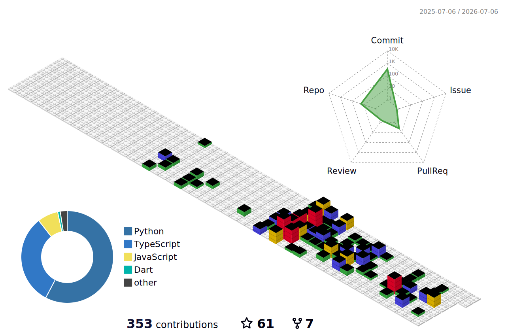

<table>
<tr>
<td width="220" align="center" valign="top">
  
   
   
  
</td>
<td valign="middle">

### Ryder Sun

  <a href="./README.zh.md">中文</a> | <a href="./README.md">English</a>

Currently working as an AI Product Manager at the Zhongguancun Artificial Institute「ZGCI」, I previously worked at leading technology companies such as Zhipu and Meituan. I am skilled in the full-stack design of 0-1 products, including service systems, architecture, iteration directions, and more. I can connect research, data infrastructure, and execution systems into a production-ready loop to build proxy native products.

</td>
</tr>
</table>

## Capability Map

| Layer | Focus | Outcome |
| --- | --- | --- |
| Product Systems | Agent workbenches, interaction design, operator workflows | Turn model capability into usable products |
| Execution Logic | Orchestration, automation, decomposition, tool use | Keep complex flows running reliably |
| Data Infrastructure | Crawling, cleaning, structuring, storage | Turn noisy input into reusable knowledge |
| Knowledge Layer | Knowledge graphs, academic profiling, entity modeling | Give systems long-term memory and usable context |

## Tech Stack

Most of my work sits across `Python`, `TypeScript`, and `Dart`, with a bias toward clean system boundaries and maintainable execution.

  
  
  
  
  
  
  
  

## Featured Projects

<table>
<tr>
<td width="50%">

#### 🌐 [Realm](https://github.com/Ryder-MHumble/Realm) `⭐ 23`
> Real-time 3D visualization of AI agent activity — multi-agent orchestration visualizer with REST API integration.

</td>
<td width="50%">

#### 🔬 [EvoLabeler](https://github.com/Ryder-MHumble/EvoLabeler-AIAgent-MLOps) `⭐ 12`
> Self-evolving MLOps engine for remote sensing — Multi-Agent system (IDEATE framework) for automated detection.

</td>
</tr>
<tr>
<td width="50%">

#### 🎓 [Scholars-System](https://github.com/Ryder-MHumble/Scholars-System) `⭐ 6`
> Academic intelligence platform — knowledge graph-powered scholar profiling and talent discovery.

</td>
<td width="50%">

#### 🕷️ [Nexus](https://github.com/Ryder-MHumble/Nexus) `⭐ 1`
> Production data pipeline — transform unstructured web content into structured, AI-ready knowledge.

</td>
</tr>
<tr>
<td width="50%">

#### 🛡️ [Skill-Watchman](https://github.com/Ryder-MHumble/Skill-Watchman) `⭐ 1`
> Governed skill routing for AI agents — safer installs, smarter picks, less prompt noise.

</td>
<td width="50%">

#### 🐱 [Guameow](https://github.com/Ryder-MHumble/Guameow) `⭐ 4`
> AI fortune app for Gen Z — daily fortune, AI chat, tarot, and playful interaction loops.

</td>
</tr>
</table>

## Build Signals

These panels show the contribution surface as a 3D map generated by [github-profile-3d-contrib](https://github.com/yoshi389111/github-profile-3d-contrib). The workflow runs daily and can also be triggered manually from GitHub Actions.

  

## Personal Site

  

For a fuller view of my background, project context, and operating style:

  

## Contact

If you are building AI products, agent systems, or knowledge infrastructure, or need to move a research-grade prototype into a working delivery, feel free to reach out.

  
  
  
  
  
  
  

