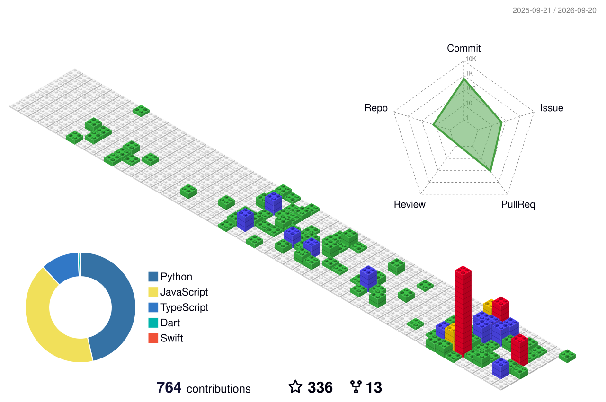

<table>
<tr>
<td width="220" align="center" valign="top">
  
   
   
  
</td>
<td valign="middle">

### Ryder Sun

  <a href="./README.zh.md">中文</a> | <a href="./README.md">English</a>

目前就职于中关村人工智能研究院的AI产品经理岗位，曾在智谱、美团等头部科技公司工作，我擅长0-1产品的全栈设计，包括服务体系、架构、迭代方向等等。我能通过研究、数据基础设施和执行系统连接成可用于生产的循环，构建代理原生产品。

</td>
</tr>
</table>

## 能力版图

| 层级 | 关注点 | 交付结果 |
| --- | --- | --- |
| Product Systems | Agent 工作台、交互体验、使用场景设计 | 让模型能力真正被使用 |
| Execution Logic | 编排、自动化、任务拆解、工具调用 | 让复杂流程稳定执行 |
| Data Infrastructure | 抓取、清洗、结构化、入库 | 让噪声输入变成可复用知识 |
| Knowledge Layer | 知识图谱、学术画像、实体关系建模 | 让系统具备长期记忆和高质量上下文 |

## 技术栈

主要工作在 `Python`、`TypeScript` 和 `Dart` 之间，偏好把模型能力包进清晰、可维护的系统边界里。

  
  
  
  
  
  
  
  

## 代表项目

<!-- featured-projects:start -->
<table>
<tr>
<td width="50%">

#### 🧩 [Meldwork](https://github.com/Ryder-MHumble/Meldwork) `⭐ 58`
> 本地优先的桌面工作区，用于持久化多 Agent 任务、原生 CLI 会话和受控协作。

</td>
<td width="50%">

#### 🌐 [Realm](https://github.com/Ryder-MHumble/Realm) `⭐ 26`
> AI Agent 活动的实时 3D 可视化，多 Agent 编排可视化器，并支持外部系统 REST API 接入。

</td>
</tr>
<tr>
<td width="50%">

#### 🔬 [EvoLabeler](https://github.com/Ryder-MHumble/EvoLabeler-AIAgent-MLOps) `⭐ 15`
> 面向遥感目标检测的自进化 MLOps 引擎，基于 IDEATE 框架的 Multi-Agent 系统。

</td>
<td width="50%">

#### 🎓 [Scholars-System](https://github.com/Ryder-MHumble/Scholars-System) `⭐ 9`
> 学术情报平台，基于知识图谱构建学者画像与人才发现能力。

</td>
</tr>
<tr>
<td width="50%">

#### 🐱 [Guameow](https://github.com/Ryder-MHumble/Guameow) `⭐ 8`
> 面向 Z 世代的 AI 玄学 App，包含每日运势、AI 聊天、塔罗和轻量互动循环。

</td>
<td width="50%">

#### 🛰️ [TDA-YOLO](https://github.com/Ryder-MHumble/TDA-YOLO) `⭐ 7`
> 面向无人机遥感目标检测的自适应 YOLO 框架，强化采样机制与检测头设计。

</td>
</tr>
</table>
<!-- featured-projects:end -->

## 构建信号

这里改为使用 [github-profile-3d-contrib](https://github.com/yoshi389111/github-profile-3d-contrib) 生成的 3D contribution map。Workflow 会每天自动运行，也可以在 GitHub Actions 里手动触发。

  

## 个人主页

  

更完整的履历、项目背景和工作方式，放在个人主页里。

## 联系方式

如果你在做 AI 产品、Agent 系统、知识基础设施，或者需要把研究型原型推进到可运行交付，欢迎联系我。

  
  
  
  
  
  
  

